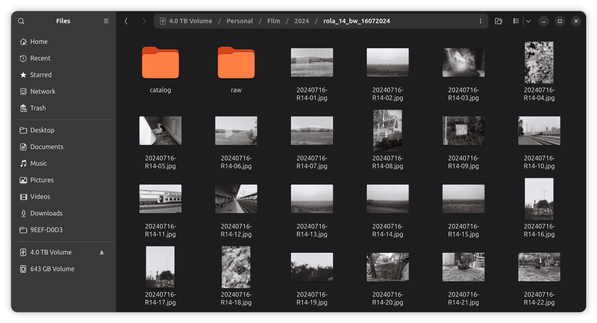

# Film collage

Transform your film scans into a beautiful collage.

From this:


To this:


### How to generate

* build the jar with `gradle jar` or download it from Releases
* place the jar in the root folder where your images are located
* create a `data.txt` file
* run `java -jar film-collage.jar`. This will create your collage.
* in case you have multiple folders where you want to create collages, copy `run.sh` into a parent folder and run it.
This will search recursively for the .jar files and each one will be executed.

data.txt
```text
Kodak Gold 200  | Film
35mm            | supports both 35mm and 120
3:2             | supports multiple formats like 3:2, 6:6, 6:4.5, 7:6
31.12.2023      | Date
R01             | Roll, it's the count of collage, useful in case you have multiple film scans
by valentin     | Extras, this line is optional
```
